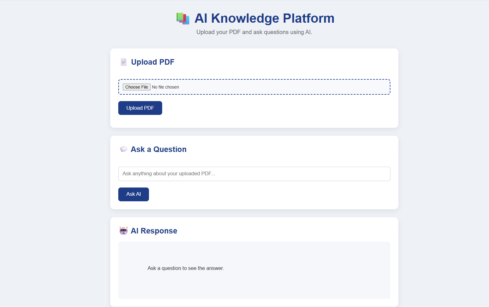
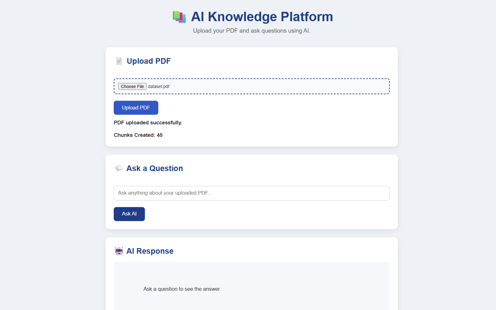
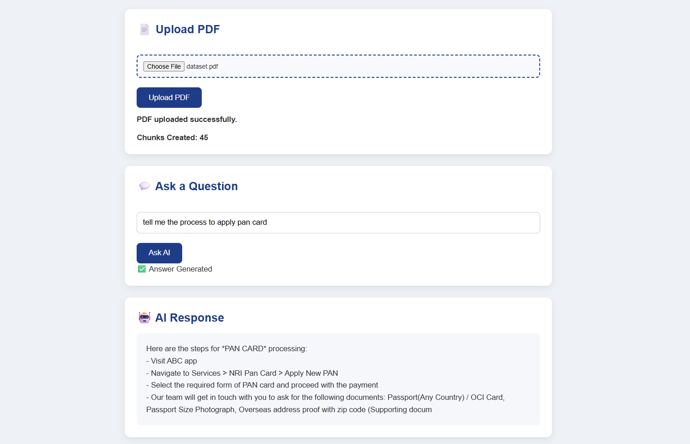
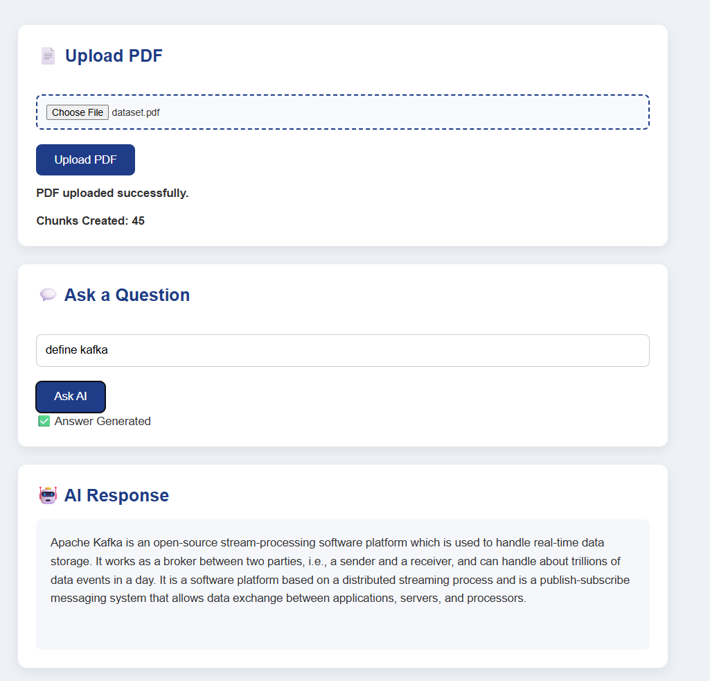

# 📚 AI Knowledge Platform (RAG)

An AI-powered Knowledge Platform that allows users to upload PDF documents and ask questions using Retrieval-Augmented Generation (RAG). The application performs semantic search using vector embeddings and generates context-aware answers with an LLM.

---

## 🚀 Features

- 📄 Upload PDF documents
- ✂️ Automatic text extraction and chunking
- 🧠 Generate embeddings using Sentence Transformers
- 🗄️ Store embeddings in ChromaDB
- 🔍 Semantic search over document chunks
- 🤖 AI-powered question answering
- 🌐 Simple web interface built with HTML, CSS, and JavaScript

---

## 🏗️ Tech Stack

| Component | Technology |
|----------|------------|
| Backend | FastAPI |
| Frontend | HTML, CSS, JavaScript |
| Embedding Model | sentence-transformers (all-MiniLM-L6-v2) |
| Vector Database | ChromaDB |
| LLM | Google Gemini API *(can be replaced with Ollama/Llama 3.2)* |
| Language | Python |

---

## ⚙️ How It Works

```text
Upload PDF
      │
      ▼
Extract Text
      │
      ▼
Create Text Chunks
      │
      ▼
Generate Embeddings
      │
      ▼
Store in ChromaDB
      │
      ▼
User Question
      │
      ▼
Semantic Search
      │
      ▼
Retrieve Relevant Chunks
      │
      ▼
Build Prompt
      │
      ▼
Gemini LLM
      │
      ▼
AI Response
```

---

## 🛠️ Installation

Clone the repository:

```bash
git clone https://github.com/<your-username>/ai-knowledge-platform-rag.git
```

Create a virtual environment:

```bash
python -m venv .venv
```

Activate the virtual environment:

**Windows**

```bash
.venv\Scripts\activate
```

Install dependencies:

```bash
pip install -r requirements.txt
```

Run the application:

```bash
python -m uvicorn app.main:app --reload
```

Open your browser:

```
http://127.0.0.1:8000
```

---


<h2 align="center">results</h2>

<table align="center">
<tr>
<td align="center">

<b>Home Page</b><br><br>



</td>

<td align="center">

<b>PDF Uploaded</b><br><br>



</td>
</tr>

<tr>
<td align="center">

<b>AI Response - Example 1</b><br><br>



</td>

<td align="center">

<b>AI Response - Example 2</b><br><br>



</td>
</tr>
</table>


---

## 🔮 Future Enhancements

- Local LLM support using Ollama
- Conversation history
- Source citations in responses
- Voice Assistant Integration
- Streaming AI responses

---


